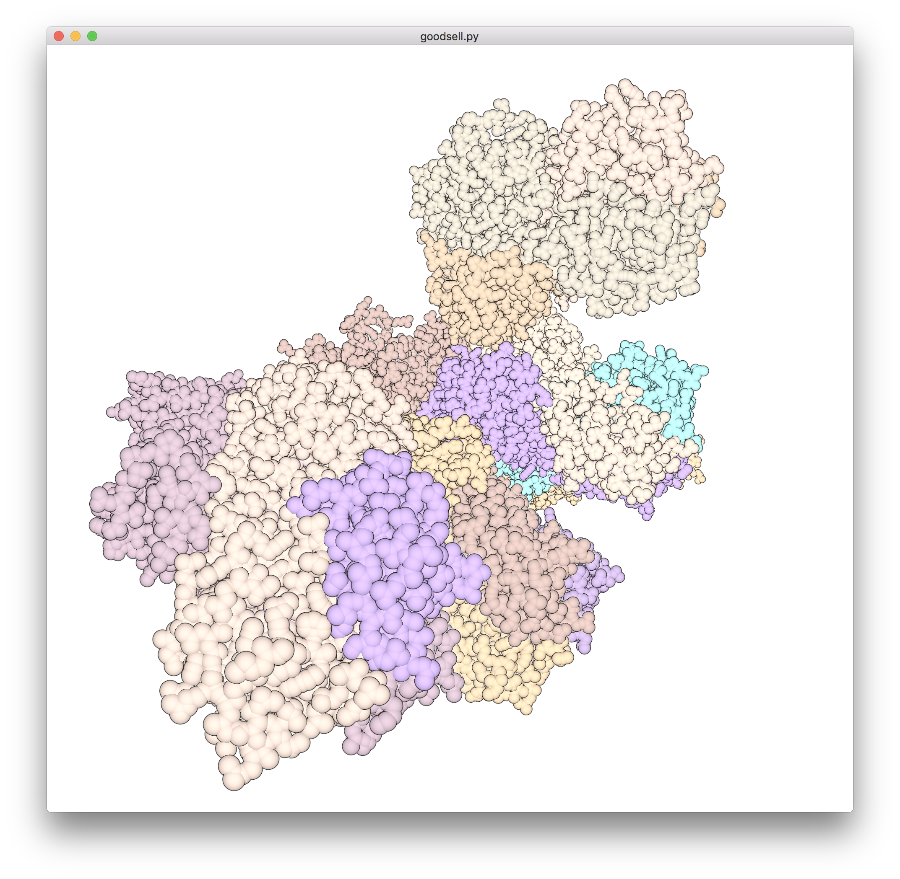
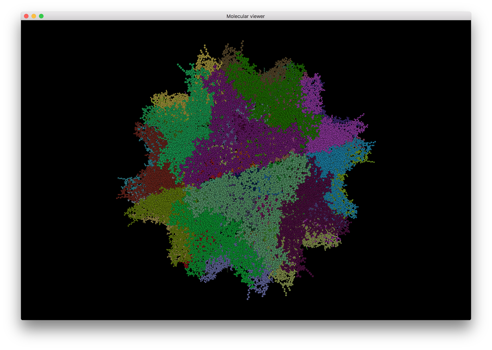

# kendrew

Visualizing molecules from Python.





## Installation

Requirements:

* [VisPy](http://vispy.org/)
* [BioPython](http://biopython.org/)
* [NumPy](http://www.numpy.org/)

Install them with pip:

```
$ pip3 install numpy vispy biopython
```

## Running

```
$ python3 goodsell data/1e57.pdb --chain
```
